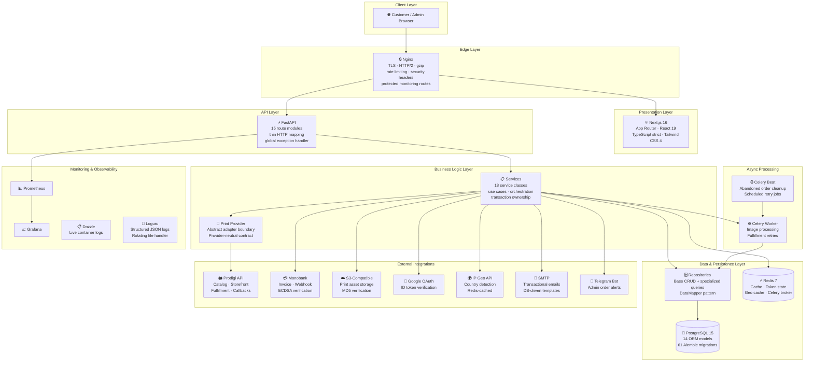
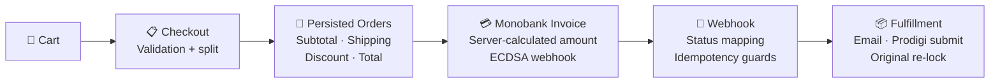
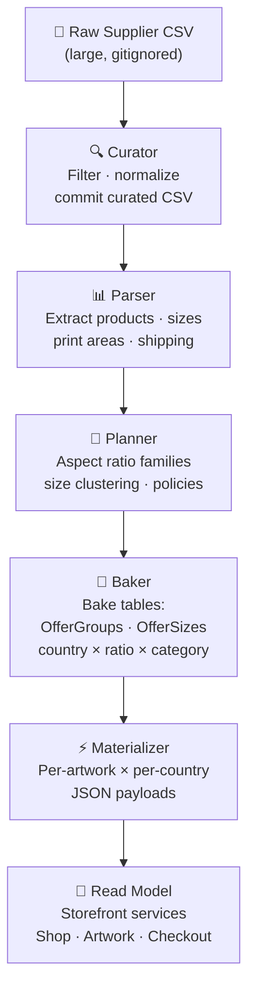
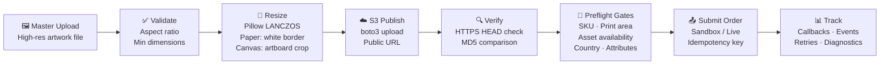
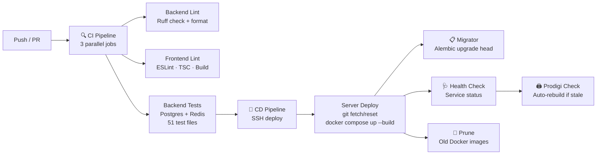

<div align="center">

# 🎨 ArtShop

### Production-Grade Art Commerce Platform

**End-to-end system for selling original artwork and fine art prints — with print-on-demand fulfillment, secure payment processing, automated deployment, and a full admin operations center.**

<br/>

[](https://github.com/SamenB/ArtShop/actions/workflows/ci.yml)
[](https://github.com/SamenB/ArtShop/actions/workflows/cd.yml)
[](https://www.python.org/downloads/)
[](https://fastapi.tiangolo.com/)
[](https://nextjs.org/)
[](https://www.postgresql.org/)
[](https://redis.io/)
[](https://docs.docker.com/compose/)
[](LICENSE)

🔗 **Live:** [samen-bondarenko.com](https://samen-bondarenko.com)

</div>

<br/>

## Overview

ArtShop is a live, working art commerce platform powering [samen-bondarenko.com](https://samen-bondarenko.com) — my personal gallery and online shop as a painter. This is not a demo or a pet project: it is a real product that accepts orders, processes payments, and fulfills print-on-demand deliveries worldwide. The entire system — backend architecture, frontend design, admin tooling, deployment pipeline — was designed and built by me, with AI assistance on the frontend implementation.

**The project is backend-heavy by design.** Business correctness — prices, shipping, payment state, print availability, fulfillment decisions — lives in backend source-of-truth layers. The frontend presents and orchestrates already-resolved data. This ensures consistency across the shop, checkout, payment gateway, admin dashboard, and external providers.

> **Key numbers:** 18 backend services · 14 ORM models · 31 Prodigi service modules · 51 test files · 61 Alembic migrations · 12 production Docker services · 2 CI/CD pipelines

---

## System Architecture



---

## Tech Stack

<table>
<tr>
<td width="160"><strong>🔧 Backend Core</strong></td>
<td>Python 3.12 · FastAPI · Pydantic v2 · SQLAlchemy 2 (async) · asyncpg · Alembic · Uvicorn</td>
</tr>
<tr>
<td><strong>🗄️ Data & Cache</strong></td>
<td>PostgreSQL 15 · Redis 7 · fastapi-cache2 · Celery + Celery Beat</td>
</tr>
<tr>
<td><strong>🔐 Security</strong></td>
<td>PyJWT (access + refresh tokens) · pwdlib / Argon2 · ECDSA webhook verification · Redis token whitelist/blacklist · Rate limiting</td>
</tr>
<tr>
<td><strong>🔗 Integrations</strong></td>
<td>Prodigi Print API · Monobank Acquiring · Google OAuth · IP Geo API · S3-compatible storage (boto3) · SMTP · Telegram Bot API</td>
</tr>
<tr>
<td><strong>🖼️ Image Pipeline</strong></td>
<td>Pillow (LANCZOS resampling) · WebP conversion · Multi-variant generation (original / large / medium / thumb)</td>
</tr>
<tr>
<td><strong>⚛️ Frontend</strong></td>
<td>Next.js 16 (App Router) · React 19 · TypeScript 5 (strict) · Tailwind CSS 4 · lucide-react · PostHog analytics</td>
</tr>
<tr>
<td><strong>🏗️ Infrastructure</strong></td>
<td>Docker · Docker Compose (12 services) · Nginx (TLS, HTTP/2, gzip) · Let's Encrypt · GitHub Actions CI/CD</td>
</tr>
<tr>
<td><strong>📊 Monitoring</strong></td>
<td>Prometheus · Grafana · Node Exporter · Dozzle (live logs) · Loguru (structured JSON logging, rotating files)</td>
</tr>
<tr>
<td><strong>✅ Quality</strong></td>
<td>pytest · pytest-asyncio · Ruff (linter + formatter) · ESLint · TypeScript checks · CI build/test gates</td>
</tr>
<tr>
<td><strong>💾 Backup</strong></td>
<td>Automated pg_dump + rclone to Google Drive (database + media differential sync)</td>
</tr>
</table>

---

## Backend Architecture Deep Dive

### Layered Design

The backend follows a strict layered architecture with clear responsibility boundaries:

```
API Routes         → HTTP mapping, auth guards, request/response contracts only
    ↓
Services           → Business rules, use cases, orchestration, transaction timing
    ↓
Repositories       → SQL/ORM queries, persistence details, DataMapper pattern
    ↓
Models             → SQLAlchemy ORM persistence shape (14 models)
```

**Key design rules:**
- Business policy never lives in routes, serializers, Celery tasks, or frontend code
- Services own commits/rollbacks — repositories don't decide business policy
- Domain exceptions (`ArtShopException` hierarchy) bubble up to a global handler that maps them to consistent `{"detail": ...}` JSON responses
- The `DBManager` implements a **Unit of Work** pattern: coordinates 13 repositories within a single atomic transaction, with deadlock retry and exponential backoff

### 🔐 Authentication & Security

| Feature | Implementation |
|---|---|
| **Token strategy** | JWT access (30 min) + refresh (7 days) pair in HTTP-only cookies |
| **Refresh tokens** | Redis **whitelist** (`rt:{jti}`): single-use rotation, auto-expires via TTL |
| **Access tokens** | Redis **blacklist** on logout (`at_bl:{token}`): lives only until token's natural expiry |
| **Password hashing** | `pwdlib` with Argon2 (recommended configuration) |
| **Google OAuth** | Server-side ID token verification via `google-auth`, auto-account creation with secure random password |
| **Rate limiting** | Redis-backed per-IP sliding window: login (5/15min), register (10/1hr), Google auth (10/5min) |
| **Admin guards** | Server-resolved from configured admin emails, enforced via FastAPI `Depends()` chain |
| **Public order refs** | XOR + Base36 encoding hides sequential database IDs in URLs, emails, and status pages |

### 💳 Checkout, Payment & Order Economics

The checkout and payment flow is fully server-owned — the browser never dictates final prices:



**Highlights:**
- **Mixed cart splitting** — originals and prints are separated into distinct order rows linked by `checkout_group_id`, paid through one Monobank invoice
- **Server-side rehydration** — print order economics are resolved from the active Prodigi storefront payload, never from browser-submitted values
- **ECDSA webhook verification** — Monobank callback signatures verified with cached public key + automatic key rotation retry
- **Payment polling** — success page actively polls backend status to cover missed/delayed webhooks
- **Abandoned order cleanup** — Celery Beat task releases locked original artworks from stale carts every hour
- **Order lifecycle timestamps** — each fulfillment transition (`confirmed → print_ordered → shipped → delivered`) auto-sets its timestamp
- **Transactional emails** — DB-driven templates (editable via admin), sent in background threads to avoid blocking the event loop

### 🖨️ Prodigi Print-on-Demand Integration

The Prodigi integration is the most architecture-heavy part of the project. It's isolated behind an **abstract `PrintProvider` adapter** (strategy pattern), making it possible to swap print vendors without changing the rest of the application.

#### Catalog → Storefront Pipeline



**Why this matters:**
- Runtime storefront reads come from **materialized payloads**, not live API probes — no supplier latency on customer requests
- The bake tables model available products across **countries × aspect ratios × product categories × sizes**
- **Policy versions** track when catalog data was last validated, enabling stale-detection and cache invalidation
- Rebuild is triggered through explicit maintenance commands or automatically during CD when the source CSV changes

#### Print Asset & Fulfillment Pipeline



**Under the hood:**
- **31 Prodigi service modules** handle: catalog pipeline, business policies, storefront bake, materialization, read models, snapshot visualization, fulfillment admin, order assets, print area resolution, shipping policies, fulfillment validation, callbacks, retries, and quality checks
- **Preflight gates** verify every requirement before submission: active SKU, correct print area dimensions, public asset availability (HTTPS + MD5), country routing, required product attributes
- **Fulfillment jobs** persist: request/response payloads, idempotency keys, payload hashes, attempt counts, provider IDs, status stages, issues, and event histories
- **Celery Beat** automatically retries eligible failed jobs every 15 minutes
- **Sandbox/Live guards** enforce `PRODIGI_SANDBOX` configuration and public callback URL checks
- Admin tools expose: forced rebuild, storefront settings, catalog preview, snapshot visualization, fulfillment jobs, preflight, submit, retry, status request, and cancellation flows

### 🖼️ Image Processing Pipeline

Gallery images are processed asynchronously via Celery:

1. Upload arrives → saved to temp → Celery task dispatched
2. Normalize color mode (RGBA/LA/P → RGB with white background compositing)
3. Generate four WebP variants: `original` (92%), `large` 2560px (90%), `medium` 1600px (86%), `thumb` 500px (78%)
4. LANCZOS resampling for high-quality downscaling, WebP method 6 compression
5. Atomic database update appends variant URLs to the artwork's JSON image array
6. Temp files cleaned up

---

## Testing & Quality

**51 test files** across unit and integration suites, with structured fixtures and mock data:

<table>
<tr><td width="250"><strong>Area</strong></td><td><strong>What's Covered</strong></td></tr>
<tr><td>🔐 Auth & Security</td><td>Registration, login, token lifecycle, admin guards, API contracts, config safety</td></tr>
<tr><td>🛒 Checkout & Orders</td><td>Mixed original/print flows, cart splitting, order economics, abandoned cleanup</td></tr>
<tr><td>💳 Payments</td><td>Monobank invoice creation, status transitions, public order references, webhook handling</td></tr>
<tr><td>🖨️ Prodigi Catalog</td><td>Pipeline stages, storefront bake, settings, snapshot visualization, shipping policies</td></tr>
<tr><td>📦 Prodigi Fulfillment</td><td>Order assets, print area resolution, fulfillment policy, admin actions, status mapping, callbacks, validation reports</td></tr>
<tr><td>☁️ Assets & Storage</td><td>S3 publication, download verification, MD5 checks for provider-ready print assets</td></tr>
<tr><td>🖼️ Image Processing</td><td>Gallery image variants, upload workflows, WebP conversion</td></tr>
<tr><td>📊 Business Logic</td><td>Artwork services, labels, likes, email templates, contact flows, print pricing, order rehydration</td></tr>
<tr><td>⚙️ Infrastructure</td><td>CI workflow safety checks, production prepare decider, print provider registry</td></tr>
</table>

**Test infrastructure:**
- Isolated test database with safety guards (refuses to run against non-test database names)
- Full schema rebuild per session via `DROP SCHEMA CASCADE` + `Base.metadata.create_all`
- JSON mock fixtures validated through Pydantic before insertion
- Mock Redis (in-memory) for token/rate-limit tests without external dependencies
- Authenticated test client fixture with admin privileges
- In-memory FastAPI cache backend

**Quality gates (enforced in CI):**

```bash
# Backend
ruff check .                    # Lint
ruff format --check .           # Format verification
pytest -v                       # 51 test files

# Frontend  
npx eslint .                    # Lint
npx tsc --noEmit                # Type checking
npm run build                   # Production build verification
```

---

## Production Deployment

### CI/CD Pipeline



**CI** runs on every push/PR with concurrency control (cancels redundant runs). **CD** triggers automatically after CI passes on `main`, deploying via SSH with zero-downtime container rebuilds.

### Production Stack — 12 Services

| Service | Container | Role |
|---|---|---|
| 🐘 **Database** | `artshop_db` | PostgreSQL 15 with persistent volumes and health checks |
| ⚡ **Cache/Broker** | `artshop_redis` | Redis 7 — cache, token state, Celery broker |
| 📋 **Migrator** | `artshop_migrator` | One-shot Alembic migration runner (exits after completion) |
| 📁 **Media Init** | `artshop_media_init` | Volume permission repair (root → appuser) |
| 🔧 **API** | `artshop_api` | FastAPI backend (non-root user, no port exposed to host) |
| ⚙️ **Worker** | `artshop_worker` | Celery background worker for async jobs |
| ⏰ **Beat** | `artshop_beat` | Celery Beat for scheduled tasks |
| ⚛️ **Frontend** | `artshop_frontend` | Next.js production build with persistent cache |
| 🔒 **Nginx** | `artshop_nginx` | Reverse proxy, TLS, HTTP/2, gzip, rate limiting, security headers |
| 📊 **Prometheus** | `monitoring_prom` | Metrics collection (15-day retention) |
| 📈 **Grafana** | `monitoring_grafana` | Dashboard UI (served from `/grafana/` subpath) |
| 📋 **Dozzle** | `monitoring_dozzle` | Live container logs (password-protected via Nginx Basic Auth) |

**Nginx security:** HTTP→HTTPS redirect, HSTS, X-Frame-Options, X-Content-Type-Options, XSS protection, restricted Swagger/OpenAPI access, rate-limited API endpoints.

**Backup:** Automated daily script — `pg_dump` to Google Drive via rclone + differential media sync from Docker volumes.

---

## Visual Walkthrough

The public storefront intentionally hides most of the operational complexity. The screenshots below show the admin side — where the real engineering lives.

<details>
<summary>
<strong>📊 Admin: Prodigi Snapshot Visualization</strong>
<br/><sub>Country-aware storefront matrix — product families, sizes, shipping routes, delivery availability, and catalog coverage after the bake/materialization pipeline.</sub>
</summary>

<!-- Add screenshot: docs/readme-assets/admin-snapshot-visualization.png -->
<!--  -->

</details>

<details>
<summary>
<strong>🖼️ Admin: Artwork Master Upload & Print Readiness</strong>
<br/><sub>Master file upload, aspect-ratio validation, print configuration, generated assets, production readiness status, and blockers before fulfillment.</sub>
</summary>

<!-- Add screenshot: docs/readme-assets/admin-artwork-master-upload.png -->
<!--  -->

</details>

<details>
<summary>
<strong>📦 Admin: Prodigi Fulfillment Pipeline</strong>
<br/><sub>Fulfillment jobs, preflight gates, provider payload state, callback history, retry controls, cost breakdown, and the operational audit trail.</sub>
</summary>

<!-- Add screenshot: docs/readme-assets/admin-prodigi-fulfillment-pipeline.png -->
<!--  -->

</details>

<details>
<summary>
<strong>💳 Admin: Orders & Monobank Checkout</strong>
<br/><sub>Order economics, payment state, Monobank invoice references, grouped checkout segments, fulfillment lifecycle, timeline, and admin operations.</sub>
</summary>

<!-- Add screenshot: docs/readme-assets/admin-monobank-orders.png -->
<!--  -->

</details>

<details>
<summary>
<strong>🎨 Public: Storefront & Artwork Page</strong>
<br/><sub>Customer-facing artwork presentation, available print products by country, regional pricing, cart flow, and checkout entry.</sub>
</summary>

<!-- Add screenshot: docs/readme-assets/public-storefront.png -->
<!--  -->

</details>

---

## Repository Structure

```
ArtShop/
├── backend/
│   ├── src/
│   │   ├── api/                        # 15 FastAPI route modules
│   │   ├── services/                   # 18 business service classes
│   │   ├── repositories/               # Data access + DataMapper pattern
│   │   ├── schemas/                    # Pydantic v2 DTOs (request/response)
│   │   ├── models/                     # 14 SQLAlchemy ORM models
│   │   ├── integrations/prodigi/       # Prodigi provider boundary
│   │   │   ├── api/                    #   Admin routes + webhooks
│   │   │   ├── catalog_pipeline/       #   Parser · Curator · Planner · Baker
│   │   │   ├── fulfillment/            #   Workflow · Gates · Assets · Status
│   │   │   ├── services/              #   31 service modules
│   │   │   ├── repositories/           #   Provider-specific persistence
│   │   │   └── tasks/                  #   Maintenance + sandbox tools
│   │   ├── print_on_demand/            # Abstract provider adapter (strategy)
│   │   ├── tasks/                      # Celery app + background jobs
│   │   ├── middleware/                 # Redis-based rate limiting
│   │   ├── connectors/                 # Telegram Bot · Redis manager
│   │   ├── migrations/                 # 61 Alembic version files
│   │   └── utils/                      # DBManager (UoW) · public order codes
│   └── tests/                          # 51 test files (unit + integration)
│       ├── unit_tests/                 #   Services · Schemas · Tasks · API
│       ├── integration_tests/          #   Full endpoint flows
│       ├── mocks/                      #   JSON fixture data
│       └── conftest.py                 #   Session fixtures · MockRedis
├── frontend/
│   └── src/
│       ├── app/                        # Next.js App Router pages
│       │   ├── admin/                  #   Admin dashboard (50+ components)
│       │   ├── shop/ gallery/ artwork/ #   Public storefront routes
│       │   ├── checkout/ profile/      #   Commerce flows
│       │   └── about/ contact/ faq/    #   Content pages
│       ├── components/                 #   Shared UI components
│       ├── context/                    #   React context providers
│       └── hooks/                      #   Custom React hooks
├── nginx/                              # Reverse proxy configuration
├── monitoring/                         # Prometheus configuration
├── scripts/                            # Production backup (pg_dump + rclone)
├── docs/                               # Operational runbooks
├── .github/workflows/                  # CI + CD pipelines
├── docker-compose.yml                  # Local dev (Postgres + Redis)
├── docker-compose.prod.yml             # Production (12 services)
└── Makefile                            # Developer commands
```

---

## Key Architectural Patterns

| Pattern | Where It's Used |
|---|---|
| **Layered Architecture** | API → Services → Repositories → Models with strict responsibility boundaries |
| **Unit of Work** | `DBManager` coordinates 13 repositories in a single transaction with deadlock retry |
| **Strategy / Adapter** | `PrintProvider` abstract base — swap print vendors without touching business logic |
| **Provider Registry** | `PROVIDER_REGISTRY` + `@lru_cache` singleton for print provider resolution |
| **Materialized Read Models** | Prodigi storefront bake tables + per-artwork JSON payloads replace live API probes |
| **Domain Exception Hierarchy** | `ArtShopException` subclasses with status codes, globally mapped to JSON responses |
| **Token Whitelist/Blacklist** | Refresh tokens on Redis whitelist (rotation), access tokens on blacklist (logout) |
| **Server-Owned Checkout** | Backend rehydrates print economics from active storefront, never trusts browser amounts |
| **Idempotent Webhooks** | Terminal payment status guards prevent duplicate processing on retried callbacks |
| **Preflight Gate System** | Multi-check verification pipeline before print order submission |
| **Pipeline Architecture** | CSV → Parse → Curate → Plan → Bake → Materialize → Read Model |
| **Background Task Orchestration** | Celery workers for image processing, Celery Beat for scheduled cleanup + retries |
| **Public Code Encoding** | XOR + Base36 transforms sequential IDs into opaque customer-facing references |

---

## Local Development

**Prerequisites:** Python 3.12 · Node.js 20+ · Docker & Docker Compose · `make`

```bash
cp .env.example .env          # Configure environment variables

make infra                     # Start PostgreSQL + Redis in Docker
make migrate                   # Apply Alembic migrations
make api                       # Start FastAPI with hot reload
make frontend                  # Start Next.js dev server

# Optional
make worker                    # Celery background worker
make beat                      # Celery Beat scheduler
make test                      # Run 51 backend test files
make lint                      # Ruff lint + format

# Prodigi maintenance
make prodigi-source            # Build curated CSV from raw supplier data
make prodigi-rebuild           # Rebuild bake tables + materialized payloads
```

---

## What This Project Demonstrates

- **Backend source-of-truth design** for money, shipping, payment state, and fulfillment — no critical calculations in the frontend
- **Real external system integration** with provider-specific logic isolated behind adapter boundaries
- **Durable catalog/read-model pipelines** instead of live API probes in customer-facing hot paths
- **Asynchronous commerce workflows** with persisted jobs, events, retries, callbacks, and admin diagnostics
- **Production deployment as part of the product** — CI/CD, TLS, monitoring, backup, health checks, not an afterthought
- **Comprehensive test coverage** across business rules, APIs, repositories, payment flows, fulfillment, and infrastructure safety checks

---

## License

This project is licensed under the [PolyForm Noncommercial License 1.0.0](LICENSE).

---

<div align="center">

Built by [Semen Bondarenko](https://github.com/SamenB)

</div>
