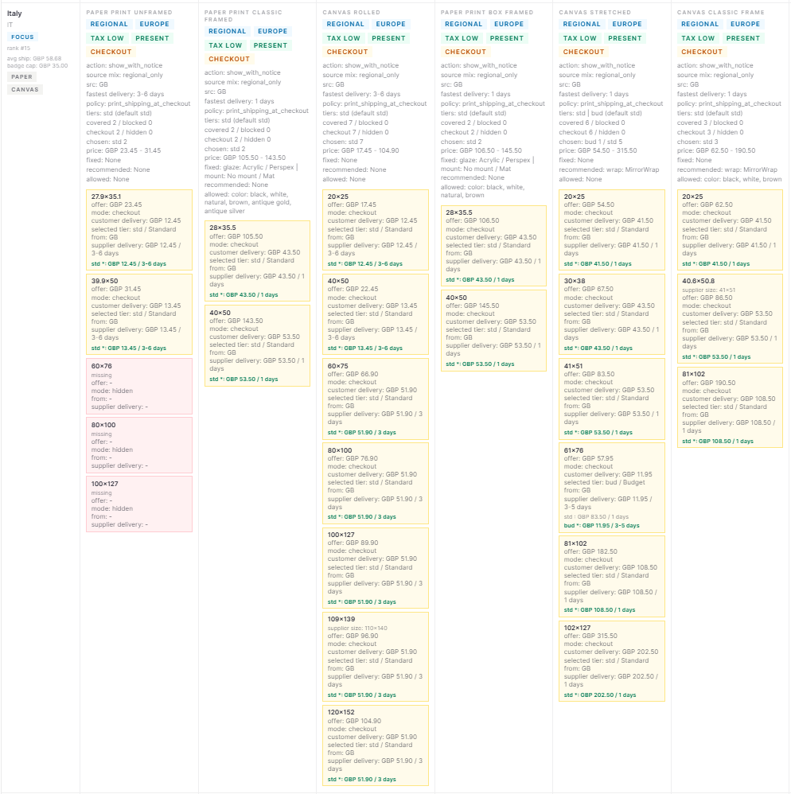

<div align="center">

<picture>
  <source media="(prefers-color-scheme: dark)" srcset="docs/readme-assets/logo.png" />
  <source media="(prefers-color-scheme: light)" srcset="docs/readme-assets/logo.png" />
  
</picture>

### Production-Grade Art Commerce Platform

**Full-stack system for selling original artwork and fine art prints — print-on-demand fulfillment, secure payments, admin operations center, and automated deployment.**

🔗 **Live:** [samen-bondarenko.com](https://samen-bondarenko.com)

<br/>

[](https://github.com/SamenB/SBGallery/actions/workflows/ci.yml)
[](https://github.com/SamenB/SBGallery/actions/workflows/cd.yml)
[](https://www.python.org/downloads/)
[](https://fastapi.tiangolo.com/)
[](https://nextjs.org/)
[](https://www.postgresql.org/)
[](https://redis.io/)
[](https://docs.docker.com/compose/)
[](LICENSE)

</div>

---

ArtShop is a live, working art commerce platform powering [samen-bondarenko.com](https://samen-bondarenko.com) — my personal gallery and online shop as a painter. This is not a demo or a pet project: it accepts real orders, processes payments, and fulfills print-on-demand deliveries worldwide. The entire system — backend architecture, frontend design, admin tooling, deployment pipeline — was designed and built by me, with AI assistance on the frontend implementation.

The project is **backend-heavy by design**. Prices, shipping, payment state, print availability, and fulfillment decisions live in backend source-of-truth layers. The frontend presents already-resolved data.

> **18** backend services · **14** ORM models · **31** Prodigi service modules · **51** test files · **61** Alembic migrations · **12** production Docker services

---

## Visual Walkthrough

The public storefront hides most of the operational complexity. The admin side is where the real engineering lives.

<details>
<summary>
<strong>📊 Admin: Prodigi Snapshot Visualization</strong>
<br/><sub>Country-aware storefront matrix — product families, sizes, shipping routes, delivery availability, and catalog coverage after the bake/materialization pipeline.</sub>
</summary>

<!--  -->

</details>

<details>
<summary>
<strong>🖼️ Admin: Artwork Master Upload & Print Readiness</strong>
<br/><sub>Master file upload, aspect-ratio validation, print configuration, generated assets, and production readiness status.</sub>
</summary>

<!--  -->

</details>

<details>
<summary>
<strong>📦 Admin: Prodigi Fulfillment Pipeline</strong>
<br/><sub>Fulfillment jobs, preflight gates, provider payload state, callback history, retry controls, cost breakdown, and audit trail.</sub>
</summary>

<!--  -->

</details>

<details>
<summary>
<strong>💳 Admin: Orders & Monobank Checkout</strong>
<br/><sub>Order economics, payment state, Monobank invoice references, grouped checkout segments, fulfillment lifecycle, and admin operations.</sub>
</summary>

<!--  -->

</details>

<details>
<summary>
<strong>🎨 Public: Storefront</strong>
<br/><sub>Customer-facing artwork presentation, available print products by country, regional pricing, and checkout entry.</sub>
</summary>

<!--  -->

</details>

---

## Tech Stack

<table>
<tr><td><strong>Backend Core</strong></td><td>Python 3.12 · FastAPI · Pydantic v2 · SQLAlchemy 2 (async) · asyncpg · Alembic · Uvicorn</td></tr>
<tr><td><strong>Data & Async</strong></td><td>PostgreSQL 15 · Redis 7 · Celery + Celery Beat · fastapi-cache2</td></tr>
<tr><td><strong>Security</strong></td><td>JWT (access + refresh) · Argon2 hashing · ECDSA webhook verification · Redis token whitelist/blacklist · Rate limiting</td></tr>
<tr><td><strong>Integrations</strong></td><td>Prodigi Print API · Monobank Acquiring · Google OAuth · IP Geo API · S3 storage (boto3) · SMTP · Telegram Bot</td></tr>
<tr><td><strong>Image Pipeline</strong></td><td>Pillow (LANCZOS) · WebP multi-variant generation · Async Celery processing</td></tr>
<tr><td><strong>Frontend</strong></td><td>Next.js 16 (App Router) · React 19 · TypeScript 5 strict · Tailwind CSS 4 · PostHog</td></tr>
<tr><td><strong>Infrastructure</strong></td><td>Docker Compose (12 services) · Nginx (TLS, HTTP/2, gzip) · Let's Encrypt · GitHub Actions CI/CD</td></tr>
<tr><td><strong>Monitoring</strong></td><td>Prometheus · Grafana · Node Exporter · Dozzle · Loguru (structured JSON, rotating files)</td></tr>
<tr><td><strong>Quality</strong></td><td>pytest (51 files) · Ruff · ESLint · TypeScript checks · CI build/test gates</td></tr>
</table>

---

## Architecture

```
API Routes  →  thin HTTP mapping, auth guards, response contracts
     ↓
Services    →  business rules, use cases, orchestration, transaction ownership
     ↓
Repositories →  SQL/ORM queries, DataMapper pattern, base CRUD
     ↓
Models       →  14 SQLAlchemy ORM models, 61 Alembic migrations
```

The `DBManager` implements a **Unit of Work** pattern — 13 repositories in one atomic transaction with deadlock retry. Domain exceptions (`ArtShopException` hierarchy) are globally mapped to consistent JSON responses. External providers live behind **adapter boundaries** (e.g., `PrintProvider` abstract base class — swap print vendors without touching business logic).

### Authentication & Security

- **JWT access (30 min) + refresh (7 days)** in HTTP-only cookies
- Refresh tokens → Redis **whitelist** with single-use rotation
- Access tokens → Redis **blacklist** on logout (lives until natural expiry)
- **Argon2** password hashing via `pwdlib`
- **Google OAuth** with server-side ID token verification and auto-account creation
- **Rate limiting** — Redis-backed per-IP sliding windows on auth endpoints
- **Public order references** — XOR + Base36 encoding hides sequential DB IDs

### Checkout & Payment Flow

- **Server-owned checkout** — the browser never dictates final prices
- Print economics **rehydrated from active Prodigi storefront payload**, not from browser-submitted values
- **Mixed cart splitting** — originals and prints become separate order rows linked by `checkout_group_id`, paid through one Monobank invoice
- **ECDSA webhook verification** for Monobank callbacks with automatic key rotation retry
- **Payment polling** — success page covers missed/delayed webhooks via Monobank status API
- **Abandoned order cleanup** — Celery Beat releases locked original artworks hourly
- **Transactional emails** — DB-driven templates editable via admin panel, sent in background threads

### Prodigi Print-on-Demand

The most architecture-heavy part. Isolated behind an abstract `PrintProvider` adapter, with 31 service modules:

```
Raw supplier CSV → Curator → Parser → Planner → Baker → Materializer → Read Model
                                                                            ↓
                                                        Shop · Artwork detail · Checkout
```

- Runtime reads from **materialized per-artwork × per-country payloads** — no live API probes
- Bake tables model products across **countries × aspect ratios × categories × sizes**
- **Preflight gates** verify: active SKU, print area dimensions, public asset availability (HTTPS + MD5), country routing, product attributes
- **Fulfillment jobs** persist request/response payloads, idempotency keys, payload hashes, events, and issues
- Celery Beat **auto-retries** failed fulfillment jobs every 15 minutes
- Print assets rendered with **Pillow LANCZOS**, uploaded to **S3**, verified via HTTPS HEAD + MD5 before submission

---

## Testing

**51 test files** across unit and integration suites:

| Area | Coverage |
|---|---|
| Auth & Security | Registration, login, token lifecycle, admin guards, config safety |
| Checkout & Orders | Mixed original/print flows, cart splitting, order economics, abandoned cleanup |
| Payments | Monobank invoice creation, status transitions, webhook handling, public order refs |
| Prodigi Catalog | Pipeline stages, storefront bake, settings, snapshot visualization, shipping policies |
| Prodigi Fulfillment | Order assets, print area resolution, fulfillment policy, admin actions, callbacks, validation |
| Assets & Storage | S3 publication, download verification, MD5 checks |
| Business Logic | Artworks, labels, likes, email templates, contact flows, print pricing, rehydration |

Test infrastructure: isolated test DB with safety guards · full schema rebuild per session · JSON mock fixtures validated through Pydantic · in-memory MockRedis · authenticated admin client fixture.

---

## Production Stack

**12 Docker services** orchestrated via Docker Compose with health checks, dependency ordering, and persistent volumes:

`artshop_db` · `artshop_redis` · `artshop_migrator` · `artshop_media_init` · `artshop_api` · `artshop_worker` · `artshop_beat` · `artshop_frontend` · `artshop_nginx` · `monitoring_prom` · `monitoring_grafana` · `monitoring_dozzle`

**CI** (every push) → backend lint + frontend lint/build + backend tests (with Postgres + Redis services)
**CD** (main branch) → SSH deploy → `docker compose up --build` → Alembic migration → Prodigi auto-rebuild if stale → image prune

**Nginx:** TLS · HTTP/2 · gzip · HSTS · security headers · rate limiting · restricted Swagger · Grafana/Dozzle routing
**Backup:** Automated `pg_dump` + rclone differential media sync to Google Drive

---

## Key Patterns

| Pattern | Application |
|---|---|
| **Layered Architecture** | API → Services → Repositories → Models with strict boundaries |
| **Unit of Work** | `DBManager` — 13 repos, one transaction, deadlock retry |
| **Strategy / Adapter** | `PrintProvider` abstract base — vendor-swappable |
| **Materialized Read Models** | Prodigi bake tables + per-artwork JSON payloads |
| **Domain Exception Hierarchy** | `ArtShopException` subclasses globally mapped to JSON |
| **Token Whitelist/Blacklist** | Refresh on whitelist (rotation), access on blacklist (logout) |
| **Server-Owned Checkout** | Backend rehydrates economics, never trusts browser amounts |
| **Idempotent Webhooks** | Terminal status guards prevent duplicate processing |
| **Preflight Gate System** | Multi-check pipeline before print order submission |
| **Pipeline Architecture** | CSV → Parse → Curate → Plan → Bake → Materialize → Read Model |
| **Public Code Encoding** | XOR + Base36 — opaque customer-facing order references |

---

## Local Development

```bash
cp .env.example .env        # Configure environment
make infra                   # PostgreSQL + Redis in Docker
make migrate                 # Alembic migrations
make api                     # FastAPI with hot reload
make frontend                # Next.js dev server
make worker                  # Celery worker (optional)
make beat                    # Celery Beat scheduler (optional)
make test                    # Run 51 backend test files
```

---

## License

[PolyForm Noncommercial License 1.0.0](LICENSE)

<div align="center">

Built by [Semen Bondarenko](https://github.com/SamenB)

</div>
